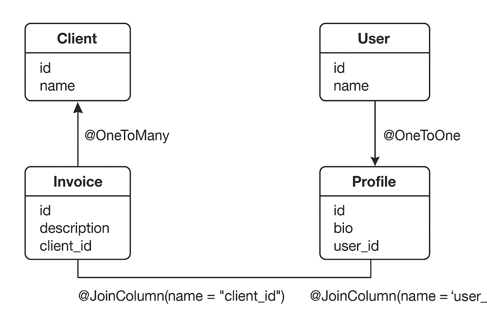

# Relaciones en JPA con @JoinColumn y mappedBy.

Mini-diagrama explicativo de cómo funcionan las relaciones en JPA con `@JoinColumn` y `mappedBy`. Me enfocaré en los casos más comunes: **OneToMany / ManyToOne / OneToOne**.



---

## 1️⃣ Relación `Client 1---* Invoice`

**Tablas:**

```
CLIENTS
+----+-------+
| id | name  |
+----+-------+

INVOICES
+----+-------------+-----------+
| id | description | client_id |
+----+-------------+-----------+
```

**Código JPA:**

```java
@Entity
@Table(name="CLIENTS")
public class Client {
    @Id
    @GeneratedValue(strategy = GenerationType.IDENTITY)
    private Long id;

    private String name;

    @OneToMany(mappedBy = "client")
    private List<Invoice> invoices;
}
```

```java
@Entity
@Table(name="INVOICES")
public class Invoice {
    @Id
    @GeneratedValue(strategy = GenerationType.IDENTITY)
    private Long id;

    private String description;

    @ManyToOne
    @JoinColumn(name = "client_id", nullable=false, foreignKey=@ForeignKey(name="FK_CLIENT_ID"))
    private Client client;
}
```

**Explicación del diagrama:**

```
Client                Invoice
------                -------
id  <---------------- client_id  (FK)
name                   description
invoices  -----> List<Invoice>  (mappedBy = "client")
```

* `mappedBy="client"` indica que la relación es **inversa**, Hibernate no crea columna extra en `CLIENTS`.
* `@JoinColumn(name="client_id")` en `Invoice` define la FK real en la tabla `INVOICES`.

---

## 2️⃣ Relación `User 1---1 Profile` (OneToOne)

**Tablas:**

```
USERS
+----+------+
| id | name |
+----+------+

PROFILES
+----+--------+--------+
| id | bio    | user_id|
+----+--------+--------+
```

**Código JPA:**

```java
@Entity
public class User {
    @Id
    private Long id;
    private String name;

    @OneToOne(mappedBy = "user")
    private Profile profile;
}

@Entity
public class Profile {
    @Id
    private Long id;
    private String bio;

    @OneToOne
    @JoinColumn(name="user_id", foreignKey=@ForeignKey(name="FK_USER_PROFILE"))
    private User user;
}
```

**Explicación:**

```
User                 Profile
----                 -------
id  <-------------- user_id (FK)
name                  bio
profile  -----> Profile (mappedBy="user")
```

* La tabla `PROFILE` tiene la FK real (`user_id`) apuntando a `USERS.id`.
* `mappedBy` en `User` indica que **no se crea columna extra**, la relación se administra desde `Profile`.

---